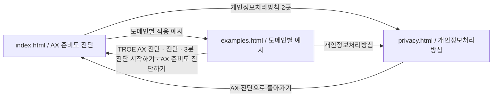

# AX 진단 사이트 링크 맵

기준 도메인: `https://ax.allrounder.im/`

## 페이지 관계

## 전체 링크 매핑

| 출발 페이지 | UI 위치·라벨 | href | 도착 페이지 | 동작 |
|---|---|---|---|---|
| `index.html` | 히어로 `도메인별 적용 예시` | `./examples.html` | `examples.html` | 같은 탭 이동 |
| `index.html` | 푸터 `도메인별 적용 예시` | `./examples.html` | `examples.html` | 같은 탭 이동 |
| `index.html` | 리드 모달 `개인정보처리방침` | `./privacy.html` | `privacy.html` | 새 탭 이동 |
| `index.html` | 푸터 `개인정보처리방침` | `./privacy.html` | `privacy.html` | 같은 탭 이동 |
| `index.html` | 푸터 이메일 | `mailto:chunghyo@troe.kr` | 메일 앱 | 외부 프로토콜 |
| `examples.html` | 헤더 브랜드 `TROE AX 진단` | `./index.html` | `index.html` | 같은 탭 이동 |
| `examples.html` | 헤더 `진단` | `./index.html` | `index.html` | 같은 탭 이동 |
| `examples.html` | 헤더 `도메인별 예시` | `./examples.html` | 현재 페이지 | 현재 메뉴 표시 |
| `examples.html` | 헤더 `3분 진단 시작하기` | `./index.html` | `index.html` | 같은 탭 이동 |
| `examples.html` | 하단 `AX 준비도 진단하기` | `./index.html` | `index.html` | 같은 탭 이동 |
| `examples.html` | 푸터 `개인정보처리방침` | `./privacy.html` | `privacy.html` | 같은 탭 이동 |
| `examples.html` | 푸터 이메일 | `mailto:chunghyo@troe.kr` | 메일 앱 | 외부 프로토콜 |
| `privacy.html` | `AX 진단으로 돌아가기` | `./index.html` | `index.html` | 같은 탭 이동 |
| `privacy.html` | 문의 이메일 | `mailto:chunghyo@troe.kr` | 메일 앱 | 외부 프로토콜 |
| `privacy.html` | Google 개인정보처리방침 | `https://policies.google.com/privacy?hl=ko` | Google 정책 | 새 탭 이동 |

## 메타 URL

| 페이지 | canonical | og:url |
|---|---|---|
| `index.html` | `https://ax.allrounder.im/` | `https://ax.allrounder.im/` |
| `examples.html` | `https://ax.allrounder.im/examples.html` | `https://ax.allrounder.im/examples.html` |
| `privacy.html` | `https://ax.allrounder.im/privacy.html` | 미설정 |

모든 내부 페이지 링크는 `./파일명` 상대경로를 사용한다. 따라서 실제 도메인 배포와 동일 폴더의 `file://` 미리보기에서 모두 작동한다.
