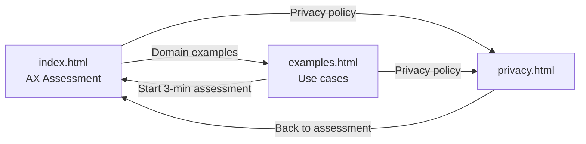
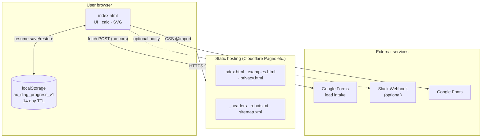
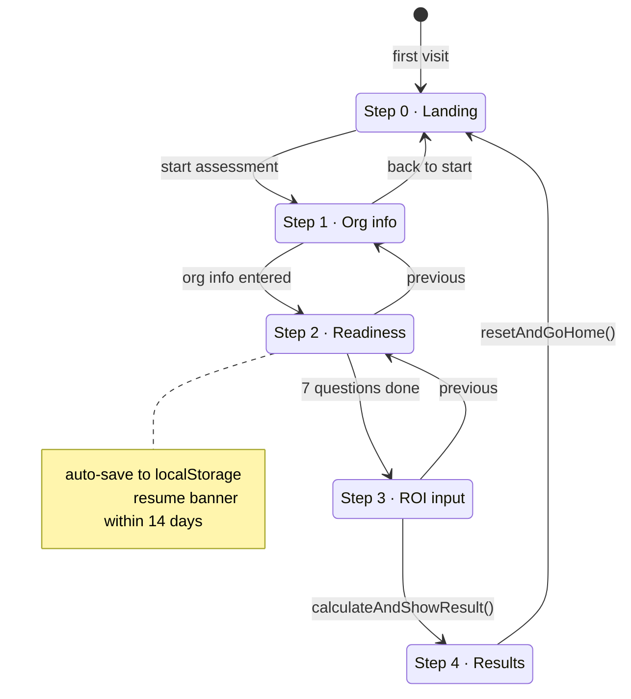
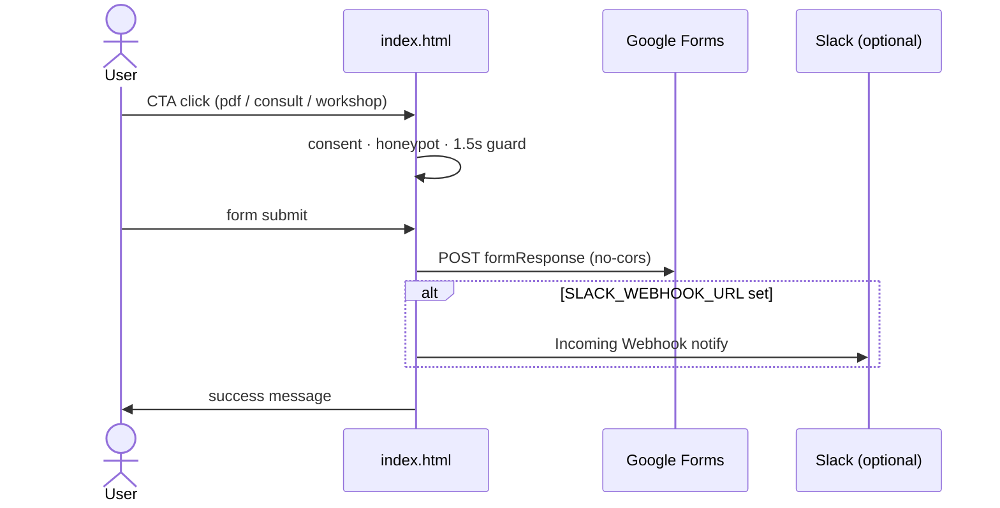
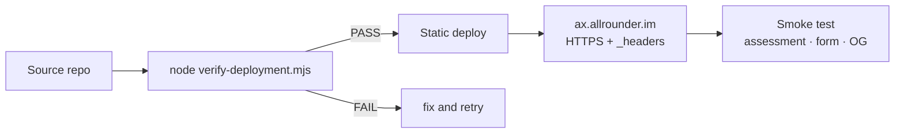

# AX Readiness & ROI Assessment

A self-service web tool by **TROE** for AI transformation (AX). Assess organizational readiness across 7 domains and estimate ROI from repetitive tasks in about 3 minutes, then optionally request a report, consultation, or workshop.

| Item | Details |
|------|---------|
| **Service URL** | https://ax.allrounder.im/ |
| **Operator** | TROE · CEO Chunghyo Park |
| **Contact** | [chunghyo@troe.kr](mailto:chunghyo@troe.kr) |
| **Business Registration** | 656-05-00206 |

> Korean documentation: [README.md](./README.md)

---

## Table of Contents

1. [Overview](#overview)
2. [Key Features](#key-features)
3. [Pages](#pages)
4. [Assessment Flow](#assessment-flow)
5. [Readiness Model](#readiness-model)
6. [Lead Capture](#lead-capture)
7. [Architecture](#architecture)
8. [Project Structure](#project-structure)
9. [Local Development](#local-development)
10. [Deployment](#deployment)
11. [Deployment Verification](#deployment-verification)
12. [Design System](#design-system)
13. [Accessibility, Security & Privacy](#accessibility-security--privacy)
14. [Operations Checklist](#operations-checklist)
15. [Related Documents](#related-documents)

---

## Overview

This service connects B2B lead generation to AX consulting and training.

- **Assessment**: Rate 7 domains (strategy, process, data, tooling, people, governance, measurement) on a 1–5 scale
- **ROI simulation**: Estimate monthly savings, payback period, and 12-month ROI from repetitive tasks
- **Action guide**: Surface 2 weakest domains and 3 recommended actions for the first 2 weeks
- **Follow-up**: Optional PDF report request, consultation, or workshop inquiry
- **Domain examples**: Industry-specific AI Agent use cases (marketing, semiconductor distribution)

Results are available immediately without email. Detailed reports and consultations are handled after lead form submission.

---

## Key Features

### AX Readiness Assessment (`index.html`)

| Feature | Description |
|---------|-------------|
| 4-step wizard | Org info → Readiness → ROI input → Results |
| Industry presets | Marketing, PR, B2B SaaS, commerce, SME defaults for tasks and reduction rates |
| Radar chart | SVG visualization of 7 domain scores |
| Maturity tiers (L1–L5) | Recommended execution track based on total score (7–35) |
| ROI adjustment | Conservative estimates with readiness score and adoption ramp |
| Progress save | Resume via `localStorage` for up to 14 days |
| Share results | LinkedIn, Facebook, X, copy link |
| Lead capture | Google Forms integration (PDF / consult / workshop) |
| Content protection | Copy, right-click, and drag restrictions (inputs exempt) |

### Domain Examples (`examples.html`)

| Feature | Description |
|---------|-------------|
| Domain tabs | Marketing org / Semiconductor distributor |
| Category filter | Browse by business area |
| Example cards | Agent proposal, starting point, KPI, guardrails (human approval) |

Examples prioritize cases where **ownership, input data, and human approval points** are clear over automation scale.

---

## Pages



| File | URL | Role |
|------|-----|------|
| `index.html` | `/` | Main assessment tool |
| `examples.html` | `/examples.html` | Domain-specific AI Agent examples |
| `privacy.html` | `/privacy.html` | Privacy policy |
| `robots.txt` | `/robots.txt` | Crawler rules |
| `sitemap.xml` | `/sitemap.xml` | Sitemap (3 URLs) |
| `_headers` | (CDN config) | HSTS, CSP, and security headers |

Internal links use relative paths (`./filename`) for static hosting and local preview. See [LINK-MAP.md](./LINK-MAP.md) for full link mapping.

---

## Assessment Flow

### Step 0 · Landing

- Service intro, 4-step overview, TROE case study carousel
- CTAs: Start assessment / How it works / Domain examples

### Step 1 · Organization Info

| Field | Required | Description |
|-------|----------|-------------|
| Industry | Recommended | Marketing, PR, B2B SaaS, commerce, SME |
| Company size | Optional | 1–10 / 11–50 / 51–200 / 201+ |
| Department/role | Optional | Free text |
| AI budget | Optional | None / individual tools / team budget / enterprise |

Industry selection auto-fills task placeholders and default reduction rates in Step 3.

### Step 2 · Readiness Assessment

7 domains rated **1 (not at all) to 5 (very much)**. All 7 questions must be answered to proceed.

### Step 3 · ROI Input

Up to **3 repetitive tasks**:

| Field | Input |
|-------|-------|
| Task name | Required for ROI calculation |
| Time per task | ≤30 min / ~1 hr / half day+ |
| Monthly volume | ≤10 / 10–50 / 50+ |
| Reduction rate | Low (30–40%) / Mid (50–60%) / High (70%+) |
| Hourly labor cost | Junior (₩25k) / Senior (₩45k) |
| Initial investment | Number (default 0) |
| Monthly AI ops cost | Number (default 0) |

**Validation**: At least one named task; costs ≥ 0.

### Step 4 · Results

- Maturity tier (L1–L5) and recommended track
- 7-domain radar chart
- 2 weakest domains + 3 first-2-week actions
- ROI analysis (monthly savings, payback, 12-month ROI, adoption ramp)
- CTAs: Report request / Consultation / Workshop

> This is a **self-assessment reference**. Detailed execution planning follows separate diagnostics (stages 01–02) after consultation.

---

## Readiness Model

### 7 Assessment Domains

| Key | Domain | Question |
|-----|--------|----------|
| `strategy` | Strategy | Are AI goals linked to company/department objectives? |
| `process` | Process | Is AI naturally embedded in daily workflows? |
| `data` | Data | Are criteria defined for what data can be used with AI? |
| `tooling` | Tooling | Can AI tools connect to business systems? |
| `people` | People | Does each role have someone capable with AI? |
| `governance` | Governance | Are approval, logging, rules, and stop procedures in place? |
| `measurement` | Measurement | Are time, quality, risk, and ROI measured together? |

### Tier Scale (Total 7–35)

| Score | Tier | Recommended Track |
|-------|------|-------------------|
| 7–14 | L1 Awareness | 90-day quick-win pilot |
| 15–21 | L2 Experiment | 90-day pilot or 6-month standardization |
| 22–27 | L3 Integration | 6-month department standardization |
| 28–32 | L4 Automation | 9-month agent automation |
| 33–35 | L5 AI-Native | 12-month enterprise transformation |

---

## Lead Capture

### Intent types

| intent | Label | Description |
|--------|-------|-------------|
| `pdf` | PDF report | Email assessment results |
| `consult` | Consultation | AX consulting follow-up |
| `workshop` | Workshop | Custom workshop scheduling |

### Submission

- **Google Forms**: `fetch` POST to `GOOGLE_FORM_ACTION` (`no-cors`)
- **Slack** (optional): Real-time notification when `SLACK_WEBHOOK_URL` is set

### Anti-spam

- Honeypot field (`leadWebsite`)
- Minimum 1.5s after modal open before submit
- Privacy consent + Google overseas transfer consent required

### Google Forms field mapping

| Field | entry ID |
|-------|----------|
| Name | `entry.536434580` |
| Email | `entry.483346616` |
| Company | `entry.283850635` |
| Role | `entry.2067240493` |
| Intent | `entry.1188245730` |

---

## Architecture

### System overview



| Layer | Technology |
|-------|------------|
| Frontend | HTML5, CSS3, Vanilla JavaScript (no build) |
| Fonts | Google Fonts (IBM Plex Sans KR, Noto Sans KR) |
| Hosting | Static site with `_headers` support |
| Lead backend | Google Forms |
| Notifications | Slack Incoming Webhook (optional) |
| SEO | canonical, Open Graph, Twitter Card, sitemap |

**No server-side code** — assessment data stays in the browser. Only lead form submissions go to Google Forms.

### Screen state machine



### Lead submission sequence



### Deployment pipeline



---

## Project Structure

```
ax.allrounder.im/
├── index.html                          # Main assessment (HTML + CSS + JS)
├── examples.html                       # Domain AI Agent examples
├── privacy.html                        # Privacy policy
├── 2026-07-09-AX-Readiness-ROI-og-image.png
├── _headers                            # Security HTTP headers
├── robots.txt
├── sitemap.xml
├── verify-deployment.mjs               # Pre-deploy verification
├── LINK-MAP.md                         # Internal link map
├── README.md                           # Korean documentation
└── README.en.md                        # This file
```

---

## Local Development

No build step required.

```bash
cd ax.allrounder.im
python3 -m http.server 8080
# → http://localhost:8080
```

```bash
npx serve .
```

Use a local HTTP server for Google Forms `fetch` testing and CSP validation.

| Key | Value |
|-----|-------|
| localStorage key | `ax_diag_progress_v1` |
| TTL | 14 days |
| Cleared on | expiry, dismiss resume, reset to home |

---

## Deployment

### Requirements

1. Deploy all static files from repo root
2. Hosting that reads `_headers` (Cloudflare Pages recommended)
3. Custom domain `ax.allrounder.im`
4. HTTPS required (HSTS preload)

### Pre-deploy check

```bash
node verify-deployment.mjs
```

### Enable Slack notifications (optional)

Set `SLACK_WEBHOOK_URL` in `index.html`:

```javascript
const SLACK_WEBHOOK_URL = "https://hooks.slack.com/services/...";
```

---

## Deployment Verification

`verify-deployment.mjs` checks:

- Required files exist and are non-empty
- JavaScript syntax and onclick handlers
- No duplicate element IDs
- SEO meta, canonical URLs, OG image
- Accessibility roles (progressbar, dialog, alert)
- ROI input guards
- Privacy disclosures (Google LLC, localStorage 14-day)
- Security headers (HSTS, CSP)

---

## Design System

Based on TROE `docu_style` color tokens.

| Token | Value | Use |
|-------|-------|-----|
| `--canvas` | `#F5F7FA` | Light background |
| `--dark` | `#050B12` | Dark sections |
| `--ink` | `#07121A` | Body text |
| `--blue` | `#0064E0` | Primary accent |
| `--muted` | `#687482` | Secondary text |

Fonts: Noto Sans KR (headings), IBM Plex Sans KR (body/UI).

Breakpoints: `640px`, `520px` (single-column mobile layout).

---

## Accessibility, Security & Privacy

### Accessibility

- Skip link, modal focus trap, Escape to close
- ARIA roles (progressbar, dialog, radiogroup, live regions)
- `prefers-reduced-motion` respected

### Security headers (`_headers`)

HSTS, CSP (self + Google Fonts + docs.google.com), nosniff, strict referrer, permissions policy.

### Privacy

- Assessment inputs: **not sent to server**; localStorage only (14 days max)
- Lead data: via Google Forms, retained 1 year then deleted
- Details: [privacy.html](./privacy.html)

---

## Operations Checklist

### On deploy

- [ ] `node verify-deployment.mjs` passes
- [ ] HTTPS works at `https://ax.allrounder.im/`
- [ ] OG image and favicon load
- [ ] Google Forms submit test (each intent once)
- [ ] Update `sitemap.xml` lastmod if pages changed

### Periodic

- [ ] Review Google Forms responses
- [ ] Verify Slack webhook (if configured)
- [ ] Update privacy policy as needed
- [ ] Review industry presets and ACTION_LIBRARY copy

---

## Related Documents

| Document | Description |
|----------|-------------|
| [README.md](./README.md) | Korean documentation |
| [LINK-MAP.md](./LINK-MAP.md) | Page link and meta URL map |
| [privacy.html](./privacy.html) | Privacy policy |

---

## License & Copyright

© TROE. UI, assessment model, and copy are TROE consulting and training assets. Unauthorized reproduction or redistribution is prohibited.

---

*Last updated: 2026-07-14*
