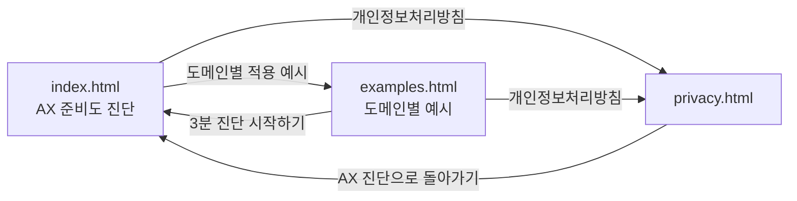
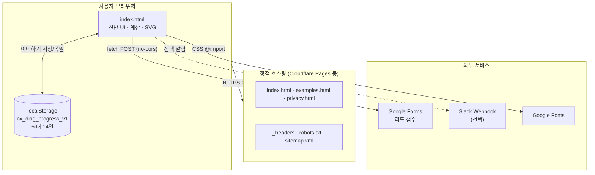
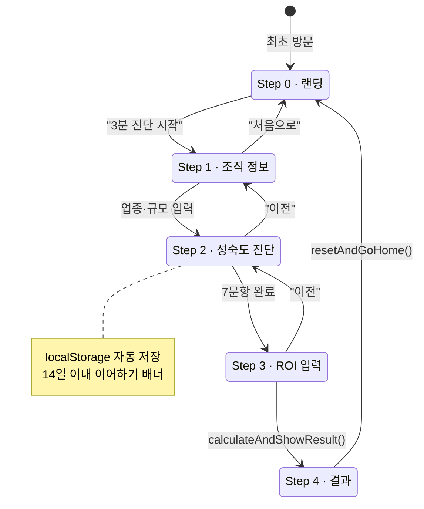
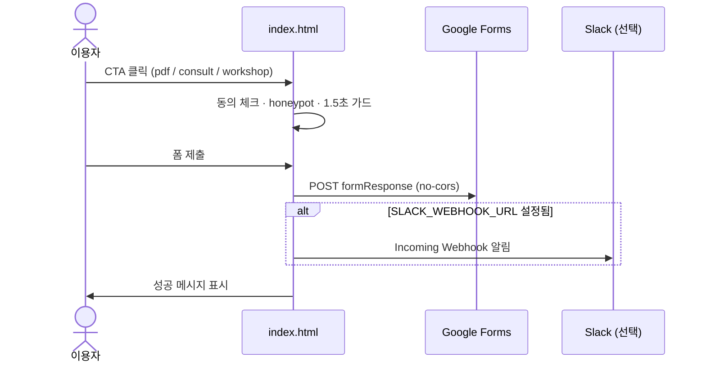
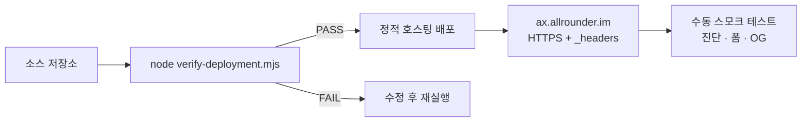

# AX 준비도와 ROI 진단

**TROE**가 제공하는 AI 전환(AX) 자가 진단 웹 도구입니다. 조직의 7개 영역 준비도와 반복 업무 ROI를 약 3분 안에 확인하고, 결과 리포트·상담·워크숍 문의로 이어질 수 있습니다.

| 항목 | 내용 |
|------|------|
| **서비스 URL** | https://ax.allrounder.im/ |
| **운영 주체** | 트로이(TROE) · 대표 박충효 |
| **문의** | [chunghyo@troe.kr](mailto:chunghyo@troe.kr) |
| **사업자등록번호** | 656-05-00206 |

---

## 목차

1. [서비스 개요](#서비스-개요)
2. [주요 기능](#주요-기능)
3. [페이지 구성](#페이지-구성)
4. [진단 흐름](#진단-흐름)
5. [성숙도 진단 모델](#성숙도-진단-모델)
6. [리드 수집](#리드-수집)
7. [기술 스택과 아키텍처](#기술-스택과-아키텍처)
8. [프로젝트 구조](#프로젝트-구조)
9. [로컬 개발 및 미리보기](#로컬-개발-및-미리보기)
10. [배포](#배포)
11. [배포 검증](#배포-검증)
12. [디자인 시스템](#디자인-시스템)
13. [접근성·보안·개인정보](#접근성보안개인정보)
14. [운영 체크리스트](#운영-체크리스트)
15. [관련 문서](#관련-문서)

---

## 서비스 개요

이 서비스는 B2B 리드 생성과 AX 컨설팅·교육으로의 연결을 목적으로 합니다.

- **진단**: 7개 영역(전략, 업무 프로세스, 데이터, 도구·기술, 사람·역량, 관리 체계, 성과 측정)을 1~5점으로 평가
- **ROI 시뮬레이션**: 반복 업무의 소요시간·건수·절감률·인건비를 입력해 월 절감액, 투자 회수 시점, 12개월 ROI 추정
- **실행 가이드**: 취약 영역 2곳과 첫 2주 추천 실행 3가지 제시
- **후속 액션**: PDF 리포트 요청, 상담 신청, 워크숍 문의 (선택)
- **도메인 예시**: 마케팅·반도체 유통 업종별 AI Agent 적용 사례 참고

이메일 없이도 진단 결과를 바로 확인할 수 있습니다. 상세 리포트와 상담은 리드 폼 제출 후 담당자가 순차 연락합니다.

---

## 주요 기능

### AX 준비도 진단 (`index.html`)

| 기능 | 설명 |
|------|------|
| 4단계 마법사 UI | 조직 정보 → 성숙도 진단 → ROI 입력 → 결과 |
| 업종별 프리셋 | 마케팅, PR, B2B SaaS, 커머스, 중소기업(일반)에 맞는 반복 업무 예시·절감률 기본값 |
| 레이더 차트 | 7개 영역 점수를 SVG로 시각화 |
| 성숙도 등급(L1~L5) | 총점 7~35점 기준 권장 실행 트랙 제시 |
| ROI 보정 | 준비도 점수·도입 곡선(1~3개월차)을 반영한 보수적 추정 |
| 진행 저장 | `localStorage`에 최대 14일간 이어하기 |
| 결과 공유 | LinkedIn, Facebook, X, 링크 복사 |
| 리드 캡처 | Google Forms 연동 (PDF / 상담 / 워크숍) |
| 콘텐츠 보호 | 복사·우클릭·드래그 제한 (입력 필드는 예외) |

### 도메인별 적용 예시 (`examples.html`)

| 기능 | 설명 |
|------|------|
| 도메인 탭 | 마케팅 조직 / 반도체 유통기업 |
| 카테고리 필터 | 업무 영역별 예시 탐색 |
| 사례 카드 | Agent 제안, 시작 방법, KPI, 가드레일(승인 지점) |

각 예시는 "자동화 규모"보다 **업무 책임자, 입력 데이터, 사람의 승인 지점**이 명확한 사례를 우선합니다.

---

## 페이지 구성



| 파일 | URL | 역할 |
|------|-----|------|
| `index.html` | `/` | 메인 진단 도구 |
| `examples.html` | `/examples.html` | 도메인별 AI Agent 적용 예시 |
| `privacy.html` | `/privacy.html` | 개인정보처리방침 |
| `robots.txt` | `/robots.txt` | 검색엔진 크롤링 허용 |
| `sitemap.xml` | `/sitemap.xml` | 사이트맵 (3개 URL) |
| `_headers` | (CDN/호스팅 설정) | HSTS, CSP 등 보안 헤더 |

내부 링크는 `./파일명` 상대경로를 사용하므로, 정적 호스팅과 로컬 `file://` 미리보기 모두에서 동작합니다. 상세 링크 매핑은 [`LINK-MAP.md`](./LINK-MAP.md)를 참고하세요.

---

## 진단 흐름

### Step 0 · 랜딩

- 서비스 소개, 진행 방식(4단계), TROE 실제 사례 캐러셀
- CTA: `3분 진단 시작하기` / `진행 방식 보기` / `도메인별 적용 예시`

### Step 1 · 조직 정보

| 필드 | 필수 | 설명 |
|------|------|------|
| 업종 | 권장 | 마케팅, PR, B2B SaaS, 커머스, 중소기업(일반) |
| 회사 규모 | 선택 | 1~10 / 11~50 / 51~200 / 201명 이상 |
| 담당 부서/직무 | 선택 | 자유 입력 |
| AI 관련 예산 | 선택 | 없음 / 개인 구독 / 팀 예산 / 전사 예산·전담 조직 |

업종 선택 시 Step 3의 반복 업무 placeholder와 절감률 기본값이 자동 반영됩니다.

### Step 2 · 성숙도 진단

7개 영역 각각 **1점(전혀 아니다) ~ 5점(매우 그렇다)**. 7문항 모두 응답해야 다음 단계로 진행할 수 있습니다.

### Step 3 · ROI 입력

반복 업무를 **최대 3개**까지 등록합니다.

| 항목 | 입력 방식 |
|------|-----------|
| 업무명 | 자유 입력 (필수, ROI 계산에 사용) |
| 건당 소요시간 | 30분 이내 / 1시간 내외 / 반나절 이상 |
| 월 발생건수 | 10건 이내 / 10~50건 / 50건 이상 |
| 절감률 | 낮음(30~40%) / 중간(50~60%) / 높음(70% 이상) |
| 시간당 인건비 | 주니어(2~3만원) / 시니어(4~5만원) |
| 초기 투자비 | 숫자 입력 (기본 0) |
| 월 AI 운영비 | 숫자 입력 (기본 0) |

**유효성 검사**

- 반복 업무명이 입력된 행이 1개 이상 있어야 함
- 초기 투자비·월 운영비는 0원 이상

### Step 4 · 결과

- 성숙도 등급(L1~L5)과 권장 실행 트랙
- 7개 영역 레이더 차트
- 취약 영역 2곳 + 첫 2주 추천 실행 3가지
- ROI 분석 (월 절감액, 투자 회수, 12개월 ROI, 도입 곡선)
- CTA: 결과 리포트 요청 / 상담 신청 / 워크숍 문의

> 이 진단은 **자가 진단용 참고 자료**입니다. 정밀한 실행 계획은 상담 이후 별도 진단(01~02단계)으로 이어집니다.

---

## 성숙도 진단 모델

### 7개 평가 영역

| 키 | 영역 | 평가 질문 |
|----|------|-----------|
| `strategy` | 전략 | AI를 쓰는 목표가 회사·부서 목표와 연결되어 있는가? |
| `process` | 업무 프로세스 | AI가 평소 업무 절차 안에 자연스럽게 들어와 있는가? |
| `data` | 데이터 | AI에 어떤 데이터를 넣어도 되는지 기준이 정해져 있는가? |
| `tooling` | 도구·기술 | AI 도구를 우리 업무 시스템과 연결할 수 있는가? |
| `people` | 사람·역량 | 역할마다 AI를 다룰 줄 아는 담당자가 있는가? |
| `governance` | 관리 체계 | 승인 절차, 사용 기록, 금지 규칙, 문제 시 중단 방법이 있는가? |
| `measurement` | 성과 측정 | 시간·품질·위험·ROI를 함께 측정하는가? |

### 등급 체계 (총점 7~35점)

| 총점 | 등급 | 권장 실행 트랙 |
|------|------|----------------|
| 7~14 | L1 인식 | 90일 빠른 성과 시범 운영 |
| 15~21 | L2 실험 | 90일 시범 운영 또는 6개월 표준화 |
| 22~27 | L3 통합 진입 | 6개월 부서 운영 표준화 |
| 28~32 | L4 자동화 진입 | 9개월 에이전트 업무 자동화 |
| 33~35 | L5 AI 네이티브 설계 | 12개월 전사 전환 |

### 취약 영역·추천 실행

- **취약 영역**: 점수가 낮은 상위 2개 영역
- **추천 실행**: 점수가 낮은 상위 3개 영역에 대응하는 `ACTION_LIBRARY` 문구 제시

---

## 리드 수집

### 신청 유형

| intent | UI 라벨 | 설명 |
|--------|---------|------|
| `pdf` | PDF 받기 | 진단 결과 리포트 이메일 발송 |
| `consult` | 상담 신청 | AX 컨설팅 상담 연결 |
| `workshop` | 워크숍 문의 | 조직 맞춤 워크숍 일정 협의 |

### 수집 항목

- 이름, 이메일, 회사명 (필수)
- 직무 (선택)
- 신청 유형

### 제출 경로

- **Google Forms**: `GOOGLE_FORM_ACTION`으로 `fetch` POST (`no-cors`)
- **Slack 알림** (선택): `SLACK_WEBHOOK_URL` 설정 시 `#ax-진단-리드` 채널로 실시간 알림

### 스팸·봇 방지

- Honeypot 필드 (`leadWebsite`)
- 모달 오픈 후 1.5초 미만 제출 차단
- 개인정보 수집 동의 + Google 국외 이전 동의 (필수)

### Google Forms 필드 매핑

| 필드 | entry ID |
|------|----------|
| 이름 | `entry.536434580` |
| 이메일 | `entry.483346616` |
| 회사명 | `entry.283850635` |
| 직무 | `entry.2067240493` |
| 신청 유형 | `entry.1188245730` |

---

## 기술 스택과 아키텍처

### 시스템 개요



| 구분 | 기술 |
|------|------|
| 프론트엔드 | HTML5, CSS3, Vanilla JavaScript (빌드 없음) |
| 폰트 | Google Fonts (IBM Plex Sans KR, Noto Sans KR) |
| 호스팅 | 정적 사이트 (Cloudflare Pages 등 `_headers` 지원 호스팅) |
| 리드 백엔드 | Google Forms |
| 알림 | Slack Incoming Webhook (선택) |
| SEO | canonical, Open Graph, Twitter Card, sitemap, robots.txt |

**서버 사이드 코드 없음** — 진단 데이터는 서버로 전송되지 않습니다. (리드 폼 제출 시에만 Google Forms로 전송)

### 진단 화면 상태 머신



### 리드 제출 흐름



### 배포 파이프라인



---

## 프로젝트 구조

```
ax.allrounder.im/
├── index.html                          # 메인 진단 도구 (HTML + CSS + JS 단일 파일)
├── examples.html                       # 도메인별 AI Agent 적용 예시
├── privacy.html                        # 개인정보처리방침
├── 2026-07-09-AX-Readiness-ROI-og-image.png   # OG 이미지·파비콘
├── _headers                            # 보안·캐시 HTTP 헤더
├── robots.txt                          # 검색엔진 크롤링 규칙
├── sitemap.xml                         # 사이트맵
├── verify-deployment.mjs               # 배포 전 정적 검증 스크립트
├── LINK-MAP.md                         # 페이지 간 링크 매핑
├── README.md                           # 한국어 문서 (이 파일)
└── README.en.md                        # English documentation
```

### `index.html` 내부 구조 (참고)

| 섹션 | 역할 |
|------|------|
| `<style>` | docu_style 기반 디자인 토큰·컴포넌트 |
| `#screen-0` ~ `#screen-4` | 5개 화면 (랜딩 + 4단계) |
| `#leadOverlay` | 리드 캡처 모달 |
| `<script>` | 상태·계산·저장·제출 로직 전체 |

---

## 로컬 개발 및 미리보기

빌드 단계가 없으므로 정적 파일 서버로 바로 확인할 수 있습니다.

```bash
# Python 내장 서버
cd ax.allrounder.im
python3 -m http.server 8080
# → http://localhost:8080
```

```bash
# Node.js npx serve
npx serve .
```

브라우저에서 `index.html`을 직접 열어도 대부분 동작하지만, `fetch`(Google Forms) 테스트와 CSP 동작 확인에는 로컬 HTTP 서버 사용을 권장합니다.

### 진행 상황 저장 키

| 키 | 값 |
|----|-----|
| `localStorage` 키 | `ax_diag_progress_v1` |
| 보존 기간 | 14일 (`PROGRESS_MAX_AGE_MS`) |
| 삭제 조건 | 만료, `처음부터 다시`, `처음으로 돌아가서 다시 진단하기` |

---

## 배포

### 요구 사항

1. 저장소 루트의 모든 정적 파일을 호스팅
2. `_headers` 파일을 인식하는 CDN/호스팅 (Cloudflare Pages 권장)
3. 커스텀 도메인 `ax.allrounder.im` 연결
4. HTTPS 필수 (HSTS `preload` 설정 포함)

### 배포 전 확인

```bash
node verify-deployment.mjs
```

`PASS`가 출력되면 필수 파일·JS 문법·중복 ID·onclick 핸들러·SEO/보안 가드가 통과한 상태입니다.

### Slack 알림 활성화 (선택)

`index.html`의 `SLACK_WEBHOOK_URL` 상수에 Incoming Webhook URL을 설정합니다.

```javascript
const SLACK_WEBHOOK_URL = "https://hooks.slack.com/services/...";
```

비어 있으면 Google Forms 제출만 수행하고 Slack 알림은 건너뜁니다.

---

## 배포 검증

`verify-deployment.mjs`는 다음을 자동 점검합니다.

| 카테고리 | 검사 항목 |
|----------|-----------|
| 파일 존재 | `index.html`, `examples.html`, `privacy.html`, `robots.txt`, `sitemap.xml`, `_headers`, OG 이미지 |
| JavaScript | 문법 오류, onclick 핸들러 누락, 중복 `id` |
| SEO | robots meta, canonical URL, OG 이미지 절대 경로 |
| 접근성 | `role="progressbar"`, `role="dialog"`, `role="alert"` |
| ROI 가드 | 빈 업무·음수 비용 입력 차단 |
| 개인정보 | 국외 이전 동의, Google LLC 고지, localStorage 14일 고지 |
| 보안 헤더 | HSTS, CSP |
| UX | 콘텐츠 보호, 사례 캐러셀 자동재생 없음 |

---

## 디자인 시스템

TROE `docu_style` 색상 토큰을 웹에 맞게 적용했습니다.

| 토큰 | 값 | 용도 |
|------|-----|------|
| `--canvas` | `#F5F7FA` | 라이트 배경 |
| `--dark` | `#050B12` | 다크 섹션 |
| `--ink` | `#07121A` | 본문 텍스트 |
| `--blue` | `#0064E0` | 주요 강조 (IBM Blue) |
| `--muted` | `#687482` | 보조 텍스트 |
| `--line` | `#DDE5EE` | 구분선·카드 테두리 |

| 폰트 | 용도 |
|------|------|
| Noto Sans KR (700, 900) | 제목 |
| IBM Plex Sans KR | 본문·UI |

반응형 브레이크포인트: `640px`, `520px` (모바일 그리드 1열 전환)

---

## 접근성·보안·개인정보

### 접근성

- 스킵 링크 (`본문으로 바로가기`)
- 모달 포커스 트랩, `Escape` 닫기
- `aria-*` 속성 (progressbar, dialog, radiogroup, live region)
- `prefers-reduced-motion` 존중

### 보안 헤더 (`_headers`)

| 헤더 | 설정 |
|------|------|
| `Strict-Transport-Security` | 1년, includeSubDomains, preload |
| `Content-Security-Policy` | self 기본, Google Fonts, docs.google.com connect/form-action |
| `X-Content-Type-Options` | nosniff |
| `Referrer-Policy` | strict-origin-when-cross-origin |
| `Permissions-Policy` | camera, microphone, geolocation 등 비활성 |

### 개인정보

- 진단 입력값: **서버 미전송**, localStorage만 사용 (최대 14일)
- 리드 정보: Google Forms 경유, 1년 보관 후 파기
- 상세 내용: [`privacy.html`](./privacy.html)

---

## 운영 체크리스트

### 배포 시

- [ ] `node verify-deployment.mjs` 통과
- [ ] `https://ax.allrounder.im/` HTTPS 정상
- [ ] OG 이미지·favicon 로드 확인
- [ ] Google Forms 제출 테스트 (각 intent 1회)
- [ ] `sitemap.xml` lastmod 갱신 (페이지 변경 시)

### 정기 점검

- [ ] Google Forms 응답 시트 확인
- [ ] Slack Webhook 동작 확인 (설정 시)
- [ ] 개인정보처리방침 적용일·내용 최신화
- [ ] 업종 프리셋·ACTION_LIBRARY 문구 검토

### 콘텐츠 수정 시 주의

- Google Forms entry ID 변경 시 `GF_ENTRIES` 동기화
- canonical·og:url 도메인 일치 유지
- `verify-deployment.mjs` expectation 목록과 충돌하지 않는지 검증 실행

---

## 관련 문서

| 문서 | 설명 |
|------|------|
| [README.en.md](./README.en.md) | English documentation |
| [LINK-MAP.md](./LINK-MAP.md) | 페이지 간 링크·메타 URL 매핑 |
| [privacy.html](./privacy.html) | 개인정보처리방침 전문 |
| TROE AX 컨설팅 | 상담·워크숍·정밀 진단(01~02단계) |

---

## 라이선스·저작권

© 트로이(TROE). 본 저장소의 UI, 진단 모델, 문구는 TROE의 컨설팅·교육 자산입니다. 무단 복제·재배포를 금합니다.

---

*README 최종 갱신: 2026-07-14*
